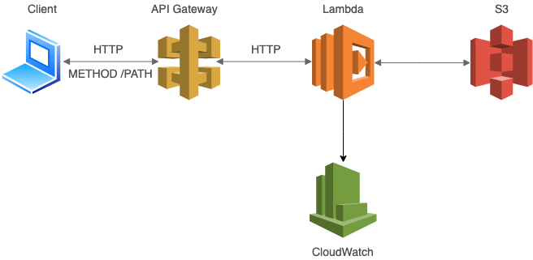

# Serverless applications with AWS Lambda and API Gateway

This scripts will show how to deploy such a simple architecture using Terraform scripts, building a AWS Lambda function and then expose these for public consumption using Amazon API Gateway, lambda will have default policy for reading/writing on S3 and using CloudWatch.

The following schema represents the architectural components involved

<p align="center" style="padding:50px">
    
</p>

## Usage

Move into this folder 
```sh
cd aws/api-gateway-lambda/
```

Run the following command
```sh
terraform init
```

and 

```sh
terraform apply
```

### Apply input variables

You can set variables directly on the command-line with the `-var` flag in `terraform apply` command to make custom architecture, running something like that

```sh
$ terraform apply \
  -var 'availability_zone_name=us-east-2' \
  -var 'api_gateway_http_method=POST' \
  -var 'lambda_function_name=my_function' \
  -var 'lambda_function_zip_path=~/Desktop/lambda.zip' \
  -var 'lambda_function_zip_name=lambda.zip' \
  -var 'lambda_function_environment_vars={"MY_ENV_1": "Love Bitcoin"}'
```

the variables are
- `availability_zone_name` regions and availability AWS [zones](https://docs.aws.amazon.com/AWSEC2/latest/UserGuide/using-regions-availability-zones.html) (default `eu-west-1`)
- `lambda_function_name` name of lambda function (default `terraform_lambda_function`)
- `lambda_function_handler` handler method of lambda (default `main`)
- `lambda_function_environment_vars` lambda environment (default `{foo = "bar"}`)
- `lambda_function_runtime` lambda [runtimes](https://docs.aws.amazon.com/lambda/latest/dg/lambda-runtimes.html) AWS
- `lambda_function_zip_path` (default `./main.zip`)
- `lambda_function_zip_name` (default `main.zip`)
- `api_gateway_name` (default `terraform_api_gateway`)
- `api_gateway_http_method` HTTP method to expose (default `GET`)
- `api_gateway_authorization` lambda authorization (default `NONE`)
- `api_gateway_path_part` (default `my-api`)

defined in `variable.tf` file.