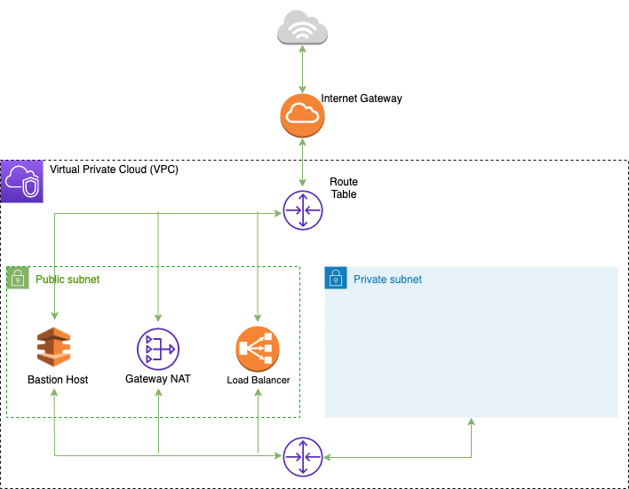

# Virtual Private Cloud (VPC) and Private Subnet
This scripts will show how to deploy [Virtual Private Cloud (VPC)](https://aws.amazon.com/vpc/?nc1=h_ls), a virtual network logically isolated from other virtual networks in the AWS Cloud. You can launch your AWS resources into `private subnet` defined (eg. EC2 instances) and specify an IP address range for the VPC, add subnets, associate security groups, and configure route tables. <br>
A public subnet allows connection to the private subnet, from outside and vice versa, via Bastion Host, Load Balancer and NAT Gateway.

The following schema represents the architectural components involved

<p align="center" style="padding:50px">
    
</p>

Public security group, attached to the public subnet, and allowing only traffic to the `ssh` protocol (on port 22). Private security group allowing traffic only to the `ssh` protocol and to the custom service (eg. service running on EC2 instance) which runs on ports `22` and `security_group_ingress_1_from_port`, is allowing outbound communications to internet from private security group

## Usage

Move into this folder 
```sh
cd aws/vpc-subnet/
```

Run the following command
```sh
terraform init
```

and 

```sh
terraform apply
```

### Apply input variables

You can set variables directly on the command-line with the `-var` flag in `terraform apply` command to make custom architecture, running something like that

```sh
$ terraform apply \
  -var 'availability_zone_name=us-east-2' \
  -var 'security_group_ingress_1_from_port=8080' \
  -var 'security_group_ingress_1_to_port=8000' 
```

the variables are
- `availability_zone_name` regions and availability AWS [zones](https://docs.aws.amazon.com/AWSEC2/latest/UserGuide/using-regions-availability-zones.html) (default `eu-west-1`)
- `bastion_public_cidr` IPv4 CIDR block to associate with the public subnet (default `10.0.0.0/16`)
- `bastion_private_cidr` IPv4 CIDR block to associate with the private subnet (default `10.0.0.0/16`)
- `bastion_cluster_name` (default `bastion-cluster`)
- `security_group_ingress_1_from_port` Private security group ingress/egress from_port
- `security_group_ingress_1_to_port` Private security group ingress/egress to_port
- `security_group_ingress_1_protocol` Private security group ingress/egress protocol

defined in `variable.tf` file.